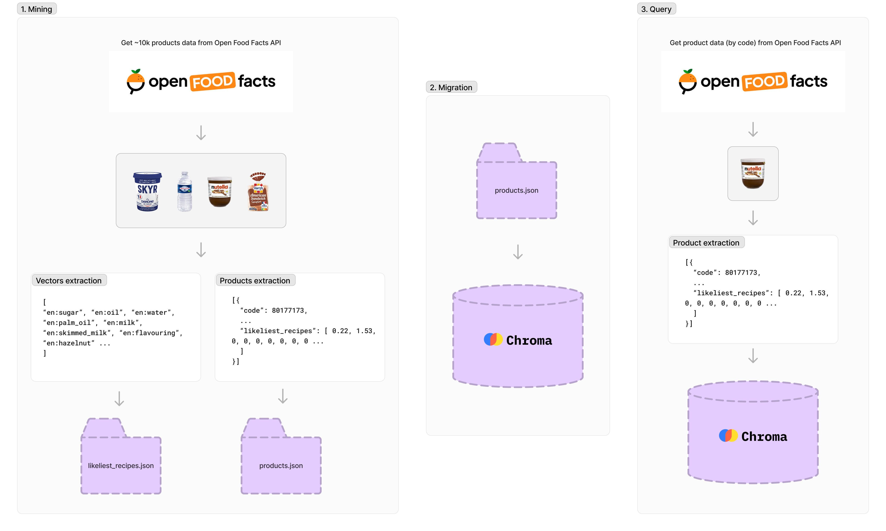
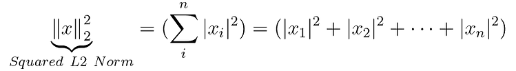

# Vector database for recommandation
Use case of similarity recommendations for food products with [Chroma](https://www.trychroma.com/) vector database based on [Open Food Facts](https://fr.openfoodfacts.org/).<br/>

## How it works


### 1. Data mining and preparation ([data-mining.js](data-mining.js))

Around 10,000 products are retrieved using the Open Food Facts API but some products lack information, so after processing, we have around 4,300 products.
Each product has a unique identifier, name, image URL, and the percentage of ingredients. There are over 1,500 indexed vectors, with each vector representing the percentage of an ingredient in the total food product (such as sugar, oil, water, etc.).<br/>
To initiate the generation of datasets, run the following command:
```shell
npm run data-mining
```

### 2. Migration on vector database ([migration.js](migration.js))
Migration will export products datasets ([`products.json`](datasets/products.json)) to local Chroma database.<br/>
To launch the migration, run:
```shell
npm run migration
```

### 3. Query the database ([query.js](query.js))
To perform a query to the vector database, you need to generate vectors from product data.<br/>
First, we call the Open Food Facts product API. Then, we generate vectors for embedding (`likeliest_recipes.json`) and use them to make a request to the database.<br/>
By default, when a query is performed on the Chroma database, similar products are determined using the `Squared L2 Norm` vector norm:



Others vector norms are also available such as the `Inner product` or `Cosine similarity`, more details on [Chroma](https://docs.trychroma.com/usage-guide?lang=js#changing-the-distance-function) and [Hnswlib](https://github.com/nmslib/hnswlib).

## Installation
1. Install required packages using npm
    ```shell
    npm ci
    ```
2. To run the Chroma database in a Docker container, expose it on port 8080
    ```shell
    docker run -p 8000:8000 chromadb/chroma:0.4.21
    ```
3. Query the database using the unique product code and display the 3 closest matches in the console.<br/>The unique product code can be found in the Open Food Facts URL (example with `3017620429484`: https://world.openfoodfacts.org/product/3017620429484/nutella-hazelnut-spread-ferrero)
    ```shell
    node ./query.js product=3017620429484
    ```

## Datasets
All datasets have been extracted using the Open Food Facts API. [Donate to Open Food Facts project](https://world.openfoodfacts.org/donate-to-open-food-facts)
- [likeliest_recipes.json](datasets/likeliest_recipes.json) - List of all indexed vectors.
- [products.json](datasets/products.json) - List of all products with their corresponding vectors.


## License
This project is licensed with GNU AGPL v3 License.</br>
See [LICENSE](./LICENSE) for more details.